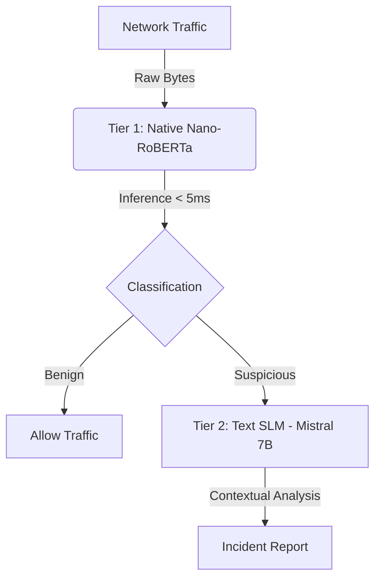

# Network Intrusion Detection using Small Language Models (SLM)

## Project Overview
This project implement a **Tiered Architecture** for detecting malicious network traffic by combining the efficiency of network-native Transformers with the reasoning capabilities of Small Language Models (SLMs).

Unlike traditional machine learning approaches that rely solely on statistical features, this system integrates **payload-aware analysis** and **natural language reasoning** to provide both high-speed filtering and detailed incident explanations.

## Project Architecture

The system utilizes a dual-tier approach to balance latency and interpretability:



### Tier 1: Network-Native Model (Nano-RoBERTa)
- **Role:** High-speed filter (Gatekeeper).
- **Input:** Raw Hex Payloads (e.g., shellcode signatures).
- **Architecture:** Custom Byte-Pair Encoding (BPE) Tokenizer + 4-layer Transformer.
- **Performance:** Sub-millisecond inference time per packet.
- **Status:** Trained on synthetic/fuzzed payloads.

### Tier 2: Reasoning Engine (Mistral 7B)
- **Role:** Deep analysis and explanation (Investigator).
- **Input:** Tokenized metadata and behavioral descriptions.
- **Output:** Natural language classification and reasoning (e.g., identifying NOP sleds).
- **Trigger:** Activated only when Tier 1 detects anomalies.

## Project Structure

```bash
├── slm_baseline/          # Tier 2: Text-Based Analysis
│   ├── serializer.py      #   - Feature serialization logic
│   └── slm_client.py      #   - Interface for Mistral 7B (Ollama)
│
├── slm_native/            # Tier 1: Network-Native Analysis
│   ├── bridge.py          #   - Data Bridge & Fuzzed Payload Generator
│   ├── train.py           #   - Training pipeline for Nano-RoBERTa
│   ├── tokenizer.py       #   - Custom BPE Tokenizer implementation
│   └── model.py           #   - Transformer architecture definition
│
├── tests/                 # Quality Assurance
│   └── test_project.py    #   - Unit tests for data generation and model integrity
│
├── data_loader.py         # Data ingestion (UNSW-NB15)
├── baseline_model.py      # Random Forest baseline for benchmarking
├── compare_models.py      # Main execution pipeline (Tiered Logic)
└── requirements.txt       # Project dependencies
```

## Setup and Execution

### Prerequisites
- Python 3.10+
- Ollama (running Mistral 7B)

### Installation
1.  **Initialize Environment**
    ```bash
    python3 -m venv .venv
    source .venv/bin/activate
    pip install -r requirements.txt
    ```

2.  **Start Local SLM**
    ```bash
    ollama run mistral
    ```

### verification
To ensure system integrity, run the unit test suite:
```bash
python -m unittest tests/test_project.py
```

### Usage
Execute the main pipeline demonstration:
```bash
python compare_models.py
```

## Methodology

### Data Handling
The system uses **UNSW-NB15** for statistical baselines. A custom **Data Bridge** (`slm_native/bridge.py`) generates context-aware synthetic payloads using dynamic fuzzing to train the native model on realistic byte patterns (e.g., HTTP headers, DNS queries, shellcode).

### Reproducibility
All dependencies are pinned in `requirements.txt`. Random seeds are controlled in data generation scripts to ensure consistent testing results.
