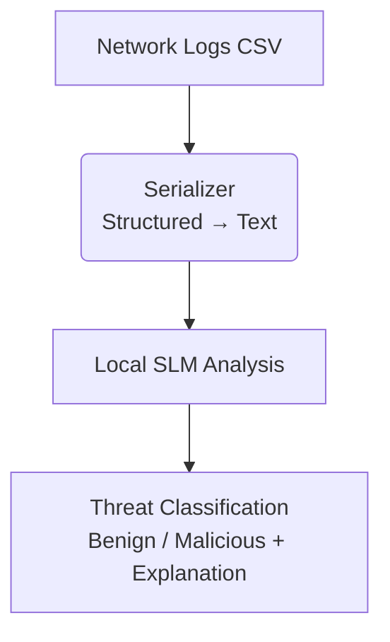

# Network Intrusion Detection using Small Language Models (SLM)

##  Project Overview
This project explores a novel approach to cybersecurity: using **Generative AI (Small Language Models)** to detect malicious network traffic. Instead of treating network logs purely as numbers (like traditional Machine Learning), we convert them into natural language sentences and ask an AI model to "reason" about them.

We compare this modern approach against a strong industry baseline (**Random Forest**) to understand the trade-offs between accuracy, speed, and explainability.

##  Technology Stack & Rationale

### 1. **Core AI Engine: Ollama + Mistral 7B**
*   **What it is**: An open-source, locally hosted Large Language Model.
*   **Why we used it**:
    *   **Privacy**: Network logs often contain sensitive IP addresses and patterns. Sending this to a cloud API (like GPT-4) is a security risk. Ollama runs offline.
    *   **Cost**: It is free to run on local hardware.
    *   **Reproducibility**: Open-source models allow anyone to replicate our results without needing paid accounts.
*   **Why not Cloud LLMs (GPT-4, Claude)?**: While more powerful, they introduce latency, cost, and significant data privacy concerns unsuitable for secure IDS systems.

### 2. **Baseline Model: Random Forest (Scikit-learn)**
*   **What it is**: A traditional ensemble learning method using decision trees.
*   **Why we used it**:
    *   It is the **state-of-the-art** for tabular data classification.
    *   It provides a "sanity check". If our fancy AI model performs worse than a simple Random Forest, we need to know.
*   **Why not Deep Learning (CNN/RNN)?**: Deep Learning requires massive datasets to train from scratch and is a "black box" (hard to interpret). Our goal was to leverage the *pre-trained knowledge* of LLMs.

### 3. **Data Handling: Pandas & UNSW-NB15**
*   **Dataset**: **UNSW-NB15** is a modern cybersecurity dataset reflecting real-world attack vectors (Fuzzers, DoS, Exploits).
*   **Preprocessing**: We stripped ID columns and sampled balanced datasets to ensure fair testing.

##  Architecture



### The "Serializer" Innovation
The core innovation here is **Tabular-to-Text Serialization**.
*   **Input**: `proto=TCP, service=http, dpkts=40...`
*   **Output**: *"Flow: The protocol is TCP using HTTP service with 40 destination packets..."*
This bridging step allows the text-based AI to understand numerical network data.

##  How to Run

### Prerequisites
1.  **Python 3.10+**
2.  **Ollama** installed ([Download Here](https://ollama.com))

### Setup
1.  **Start the Model**:
    ```bash
    ollama run mistral
    ```
    *(Keep this running in a separate terminal)*

2.  **Install Python Dependencies**:
    ```bash
    python3 -m venv .venv
    source .venv/bin/activate
    pip install pandas scikit-learn requests tqdm
    ```

### Execution
Run the main evaluation pipeline:
```bash
python3 main.py
```

##  Expected Results & Interpretation
The script runs two tests:
1.  **Random Forest**: Likely ~95-99% accuracy. Fast (milliseconds).
2.  **SLM (Mistral)**: Accuracy varies (70-95%). Slow (seconds).

**Key Takeaway**: While SLMs are slower, they offer the potential for **Chain-of-Thought reasoning**—explaining *why* a flow is malicious, which traditional models cannot do.

##  FAQ
*   **Why is it slow?**
    Generative AI generates token-by-token. A 7B parameter model requires significant computation.
*   **Can we make it faster?**
    Yes, by using smaller models (e.g., `TinyLlama`, `Phi-2`) or specialized hardware (GPUs/LPUs).
